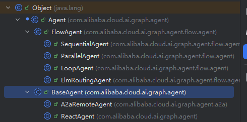
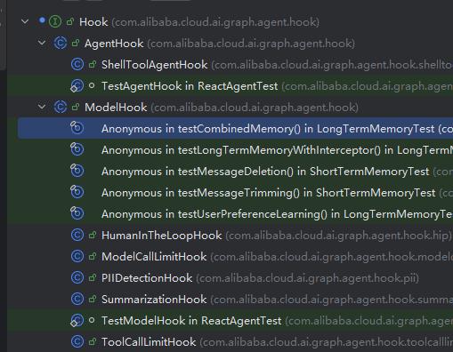

# Spring-AI-Alibaba 源码阅读笔记

## 模块：spring-ai-alibaba-agent-framework

---

## 🌟 核心特性

- ReAct 智能体实现  
- 多智能体工作流编排（Graph）  
- 上下文工程 & 记忆管理  
- 人机协作（Human-in-the-loop）  
- Agent-to-Agent（A2A）通信  
- 模型、工具、MCP（Multi-Channel Provider）生态集成  

<span style="color:#8b8b8b; font-size:0.85em;">
↳ ⌨️ 快捷键提示：Ctrl + H 查看继承层次结构 | Ctrl + Alt + H 查看调用关系
</span>

---

## 📌 Agent 核心类解析

### 📦 `com.alibab.cloud.ai.graph.agent.Agent`



### 🧠 核心字段说明

| 类 / 字段                                        | 作用说明                                                         |
| ------------------------------------------------ | ---------------------------------------------------------------- |
| **`Agent`（抽象类）**                            | 所有智能体的根基类，定义身份、能力、生命周期                     |
| `protected String name`                          | Agent 唯一标识，在 Graph 中用于路由                              |
| `protected String description`                   | 大模型根据任务内容与 description 判断是否由该 Agent 执行         |
| `protected CompileConfig compileConfig`          | Graph 编译阶段全局配置：断点保存、缓存、中断点、超时、循环检测等 |
| `protected volatile CompiledGraph compiledGraph` | `AgentGraph.compile()` 后生成的可执行模板（类似 `.class` 文件）  |
| `protected volatile StateGraph graph`            | 单次请求时 new 出的「运行实例」，包含本次的记忆、变量、状态等    |
| `protected Executor executor`                    | 异步 / 并行任务线程池（工具调用、并行 Agent 等都在其中执行）     |

<span style="color:#8b8b8b; font-size:0.85em;">
↳ 记忆点：AgentGraph（设计图） → CompiledGraph（.class） → StateGraph（运行中的实例）
</span>

---

## 🔍 核心方法说明

### `public StateGraph getGraph()`
初始化 `StateGraph`，内部调用子类实现的：

```java
protected abstract StateGraph initGraph() throws GraphStateException;
```
```java
Agent.invoke()  Agent抽象类调用代理方法
     ↓
compiledGraph.invoke()
     ↓
streamFromInitialNode()     ── 创建 Flux 流 & 初始化 State
     ↓
GraphRunner.run()           ── 返回 Flux.defer()（订阅时才执行）
     ↓
MainGraphExecutor.execute() ── 判断节点执行条件：
        • 最大迭代次数是否达到
        • 是否需要停止
        • 是否需要恢复
        • 是否有外部打断（Human / System）
        • 是否是开始节点
        ↓
nodeExecutor.execute()      ── 子节点执行器
     • AsyncParallelNodeAction
     • SubCompiledGraphNodeAction
     • HumanInTheLoopHook
     ↓
processParallelResults()    ── 并行结果合并（优先级）
        GraphFlux > Flux > 普通对象


Agent.stream() 和上面流程一样 但是最后返回的Flux流对象
```
<!-- 
Agent.buildNonStreamConfig() 构建非流配置 -> builder.addMetadata("_stream_", false) 配置stream为false
Agent.buildStreamConfig() 构建流配置
Agent.applyExecutorConfig() 将执行器应用配置到RunnableConfig构建器

### Agent子类BaseAgent
protected String inputSchema;  输入格式
protected Type inputType;      输入类型

protected String outputSchema; 输出格式
protected Class<?> outputType; 输出类型

protected String outputKey; Agent输出结果的Key

protected KeyStrategy outputKeyStrategy; Key的输出策略 REPLACE 替换  APPEND 追加  MERGE 合并 支持自定义

protected boolean includeContents; 是否把Agent的结果暴露给后续的Agent或者用户（是否把结果假如到上下文）

protected boolean returnReasoningContents; 是否把Agent推理思考的内容也返回 -->


#### 1. `Agent.buildNonStreamConfig()`
构建 **非流式** 配置  
- 调用：`builder.addMetadata("_stream_", false)`  
- 作用：设置 `_stream_ = false`，表示关闭流式输出

#### 2. `Agent.buildStreamConfig()`
构建 **流式（Stream）** 配置  
- 设置 `_stream_ = true`  
- 用于逐 Token 输出结果

#### 3. `Agent.applyExecutorConfig()`
将执行器（Executor）相关配置应用到 `RunnableConfig` 构建器  
- 包含：模型参数、温度、top-k/p、最大 token、工具调用设置等

---

### BaseAgent 字段说明

#### 输入相关字段
- `protected String inputSchema;`  
  - 输入格式（JSON Schema）

- `protected Type inputType;`  
  - 输入类型（Java 类型，用于反序列化）

---

#### 输出相关字段
- `protected String outputSchema;`  
  - 输出格式（Schema）

- `protected Class<?> outputType;`  
  - 输出类型（反序列化用）

- `protected String outputKey;`  
  - Agent 输出结果在上下文中的存放 Key

---

#### 输出 Key 策略
- `protected KeyStrategy outputKeyStrategy;`  
  - 输出内容写入上下文的方式  
  - `REPLACE`：替换原值  
  - `APPEND`：追加内容  
  - `MERGE`：合并（Map/JSON）  
  - 支持自定义策略

---

#### 执行内容控制
- `protected boolean includeContents;`  
  - 是否将 Agent 结果写入上下文（暴露给后续 Agent 或用户）

- `protected boolean returnReasoningContents;`  
  - 是否返回 Agent 的推理过程（ReAct / 思考链路）

#### 方法
- `public abstract Node asNode(boolean includeContents, boolean returnReasoningContents);`
  -  将Agent转为可编排的节点
  -  includeContents： 是否要把执行后产生内容放到上下文
  -  returnReasoningContents：是否要把推理链路也包含在Node中

###  ReactAgent
- `private final AgentLlmNode llmNode;`
  - LLM使用的节点
- `private final AgentToolNode toolNode;`
  - 工具节点
- `private List<? extends Hook> hooks;`
  - 生命周期钩子用于在Agent执行的不同阶段插入额外逻辑
      ```java default HookPosition[] getHookPositions() {
		HookPositions annotation = this.getClass().getAnnotation(HookPositions.class);
		if (annotation != null) {
			return annotation.value();
		}
		// Default fallback based on hook type
		if (this instanceof AgentHook) {
			return new HookPosition[]{HookPosition.BEFORE_AGENT, HookPosition.AFTER_AGENT};
		} else if (this instanceof ModelHook) {
			return new HookPosition[]{HookPosition.BEFORE_MODEL, HookPosition.AFTER_MODEL};
		}
		return new HookPosition[0];
	} ```
  -  如果有HookPositions注解就使用注解里的value，如果是AgentHook那就使用BEFORE_AGENT + AFTER_AGENT，如果是ModelHook那就使用BEFORE_MODEL + AFTER_MODEL
- `private List<ModelInterceptor> modelInterceptors;`
  - model拦截器（多个）用于脱敏、打印日志、断点等
- `private List<ToolInterceptor> toolInterceptors;`
  - tool拦截器（多个）
- `private String instruction;`
  - Agent 固定的提示词，一般与LLM对话的话放到前面
- `private StateSerializer stateSerializer;`
  - 序列化文本 转为LLM可以理解的文本格式
#### 方法

- `protected StateGraph initGraph()`
  - 初始化图
    - 初始化默认节点
    - 注入钩子工具
    - 按位置分类钩子
    - 决定从哪个节点开始、哪个节点结束
    - 设置边构成链
  - `setupToolsForHooks()`  
    - hook 有些需要工具，注入 tool 工具
  - `findToolForHook()`  
    - 寻找节点工具
  - `filterHooksByPosition()`  
    - 根据 HookPosition 过滤钩子
  - `setupHookEdges()`  
    - 设置边构成链
  - `chainModelHookReverse()`  
    - 构成反的模型链（AfterModel 用）
  - `chainAgentHookReverse()`  
    - 构成反的钩子链
  - `chainHook()`  
    - 将多个 Hook 串成一个链，可以有条件跳转，构成 hooks 链
  - `setupToolRouting()`  
    - 设置工具路由
  - `buildMessagesKeyStrategyFactory()`  
    - 构建 Key 策略工厂
    - outputKey 不为空并且策略为空时，默认为替换策略
    - 默认添加 message 为附加策略，将剩余策略全部保存
  - `makeModelToTools()`  
    - 模型执行完后决定下一步执行
    - 如果工具没执行完就执行 tool，执行完就重新回到 model
    - 其他情况直接结束
  - `makeToolsToModelEdge()`  
    - 循环工具执行
    - 判断工具输出决定是直接返回还是回到模型
  - `fetchLastToolResponseMessage()`  
    - 获取工具最后一条消息
  - `public class SubGraphNodeAdapter implements NodeActionWithConfig`  
    - 用于执行子图
  - `getGraphResponseFlux()`  
    - 创建新的 Flux 流
    - 根据子图结果清除父图重复的 message，再将子图结果发送给父图
  - `getSubGraphRunnableConfig()`  
    - 子类获取 RunnableConfig
    - 构建干净的 config，并与父图的 checkpoint 逻辑保持一致性

---

### Interceptor

- **有两个实现类**：ModelInterceptor（模型拦截器）和 ToolInterceptor（工具拦截器）  
- 继承关系图：

#### ModelInterceptor

- `ContextEditingInterceptor`  
  - 用于控制上下文 token 数  
  - 太大时清理旧工具结果，避免 prompt 超出模型 token 限制
- `FilesystemInterceptor`  
  - 为 Agent 注入文件系统操纵能力  
  - 功能：ls、read_file、write_file、edit_file、glob、grep
- `ModelFallbackInterceptor`  
  - 模型调用错误时调用其他模型，增强高可用
- `PatchToolCallsInterceptor`  
  - 自动修复消息历史中未完成的工具调用  
  - 确保每个 ToolCallMessage 都有对应的 ToolResponseMessage
- `SubAgentInterceptor`  
  - 子 Agent 调用拦截器  
  - 每个复杂子 Agent 调用后，将干净简洁的结果返回给父 Agent
- `TodoListInterceptor`  
  - 为 Agent 注入“待办事项管理能力”  
  - 帮助智能体将复杂多步骤任务拆解，并向用户展示进度
- `ToolSelectionInterceptor`  
  - 为 LLM 选择相关工具，再调用主模型  
  - 筛选最相关工具，减少 token 使用，帮助主模型专注于合适工具

#### ToolInterceptor

- `LargeResultEvictionInterceptor`  
  - 自动将大型工具结果写出到文件系统  
  - 当工具调用响应超过配置的 token 限制时，保存完整结果到文件，并返回截断消息  
  - DEFAULT_TOOL_TOKEN_LIMIT = 20000
- `ToolEmulatorInterceptor`  
  - 工具模拟调用  
  - Agent 调用工具时，不实际执行真实工具，而是用 LLM 生成模拟结果
- `ToolErrorInterceptor`  
  - 工具错误拦截器
- `ToolRetryInterceptor`  
  - 重试拦截器  
  - 工具调用失败时会自动按重试策略再次尝试

#### InterceptorChain.java

- 将多个拦截器按顺序组合成链  
- 实现责任链模式

### Hook

- **Hook 有两个实现类**：AgentHook 和 ModelHook
- 

#### AgentHook
- 用于抽象 AgentHook，在 Agent 执行流程不同阶段插入不同的逻辑，易于给 Agent 的执行增加扩展
- **示例**：
  - `ShellToolAgentHook`  
    - 专门管理 ShellTool 会话的钩子  
    - 在 Agent 开始执行前创建 Shell，会话期间可以使用 shell 命令  
    - 在 Agent 执行完成后关闭或释放会话  
    - 实现了 `ToolInjection` 工具注入接口

#### ModelHook
- 用于抽象 ModelHook，在 Model 执行流程不同阶段插入不同的逻辑
- **示例**：
  - `HumanInTheLoopHook`  
    - 可以人工介入的钩子，等待人工输入确认或审核，增加安全性
  - `ModelCallLimitHook`  
    - 用于追踪和限制模型调用次数的钩子  
    - 该钩子监控 Agent 执行期间的模型调用次数，在达到指定限制时终止 Agent
  - `PIIDetectionHook`  
    - 用于检测输入中的 PII，例如：邮箱（Email）、信用卡号（Credit Card）、IP 地址、MAC 地址、URL  
    - 可选脱敏策略
  - `SummarizationHook`  
    - 监控消息的 token 数  
    - 用于在 token 快达到限制时总结历史旧对话，保证近期消息保留上下文连续性
  - `ToolCallLimitHook`  
    - 用于追踪并限制工具调用次数的钩子  
    - 在达到指定次数时终止 Agent
### LlmRoutingAgent FlowAgent的子类
- 作用：基于LLM路由智能体，根据输入内容自动选择调用哪个Agent或Tool，是智能决策Agent
### LoopAgent FlowAgent的子类
- 是一个支持多种循环的Agent 例：支持固定数量循环，基于条件循环，可以根据LoopStrategy来进行自定义实现循环策略
### ParallelAgent FlowAgent的子类
- 执行多个子Agent合并它们的结果，实现了并行扇出采集模式，输入同时分配给所有子Agent，并行执行
### SequentialAgent FlowAgent的子类
- 顺序代理，将多个子Agent按顺序串联执行
### LoopStrategy
#### ArrayLoopStrategy 
- 循环策略，把当前消息里的JSON数组取出来逐个调用Agent并汇总结果
#### ConditionLoopStrategy 
- 条件循环策略，根据条件循环调用Agent，重试直到条件满足或到达最大次数
#### CountLoopStrategy
- 固定次策略

#### ConditionEvaluator
- 是Flow中用于判断条件并写入状态的节点动作，根据当前State计算一个值，让Routing节点知道接下来应该走哪条路径
#### ConditionEvaluatorAction
- 用于用于评估条件以确定路由路径，读取状态结果并返回相应的路由

#### EnhancedParallelResultAggregator
- ParallelAgent的高级结果聚合器，用于在多个并行执行分支全部完成后，对结果进行统一合并
#### ParallelResultAggregator
- 基础版的结果聚合器
#### RoutingEdgeAction
- 根据条件选择下一条要走的路径，RoutingAgent/FlowAgent中实现条件跳转的关键组件。根据前一个Node执行的结果选择下一个Node